# AgentFrameworkRag

An **agentic RAG** chat app: upload documents, ask questions, get streamed answers with source citations. The model decides **when** to search via MAF `TextSearchProvider` and the `search_documents` tool.

| Layer | Stack |
|---|---|
| Orchestration | .NET Aspire |
| Agents | Microsoft Agent Framework (`Microsoft.Agents.AI` 1.20) |
| API | ASP.NET Core + SSE streaming |
| AI | OpenAI / Azure OpenAI |
| Vector store | InMemory or Qdrant |
| Frontend | React 19, Vite, TypeScript |

> **Component details:** [docs/FEATURES.md](docs/FEATURES.md) — MAF vs non-MAF per file.

---

## How it works (visual)

### Agentic chat — the main flow

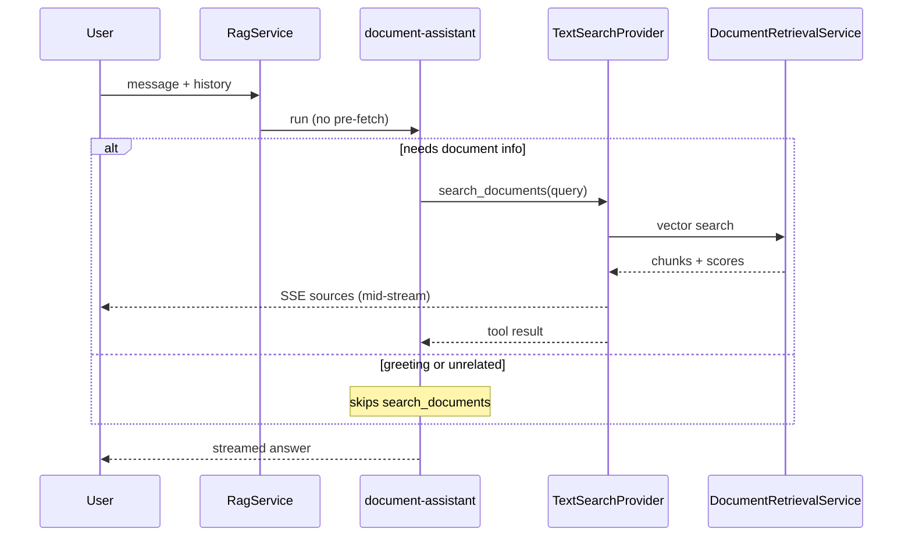

### Classic RAG vs agentic RAG (what changed)

**Before — always retrieve first:**

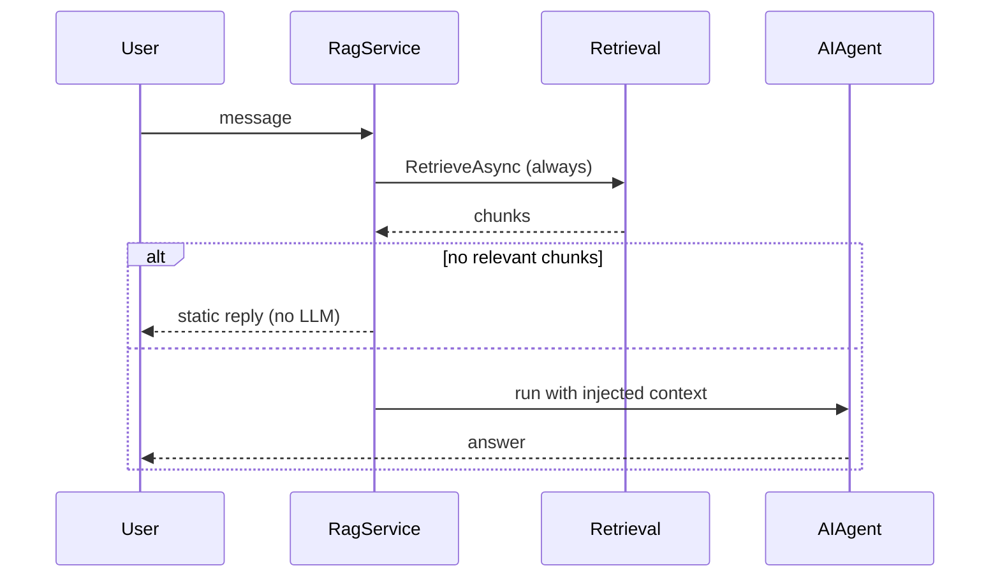

**Now — agent decides when to search:**

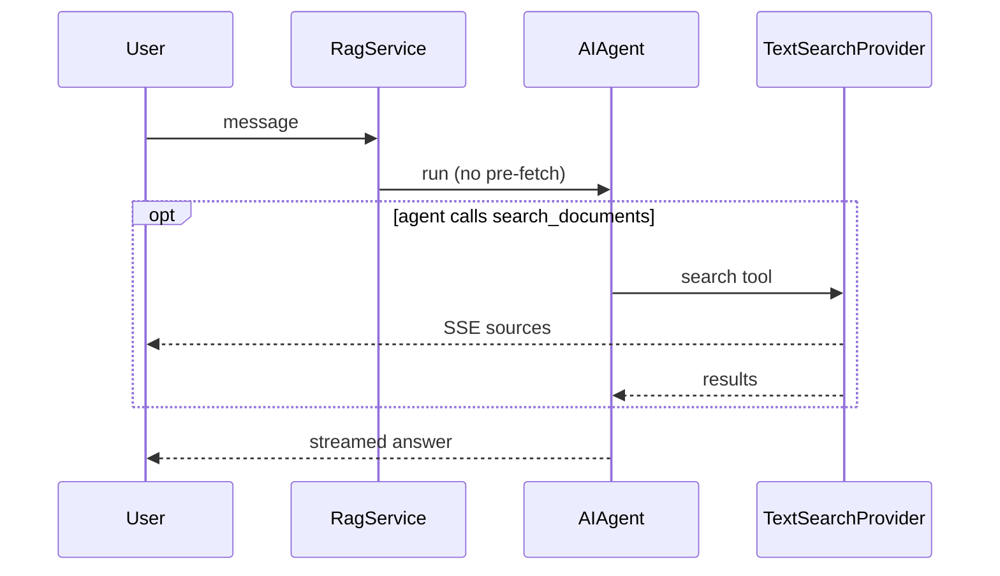

### Which agent runs?

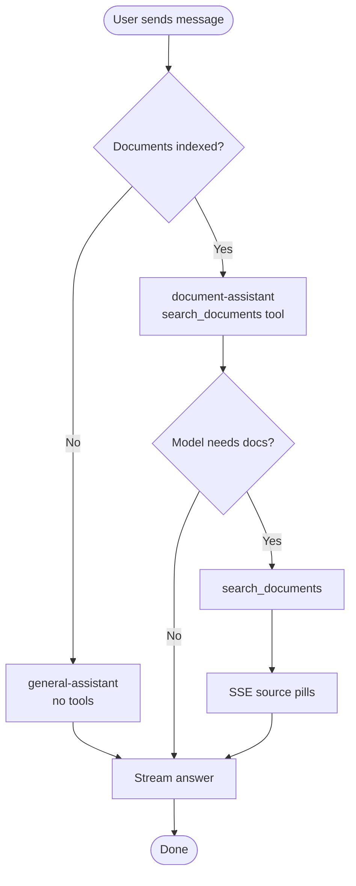

### What the UI receives (SSE timeline)

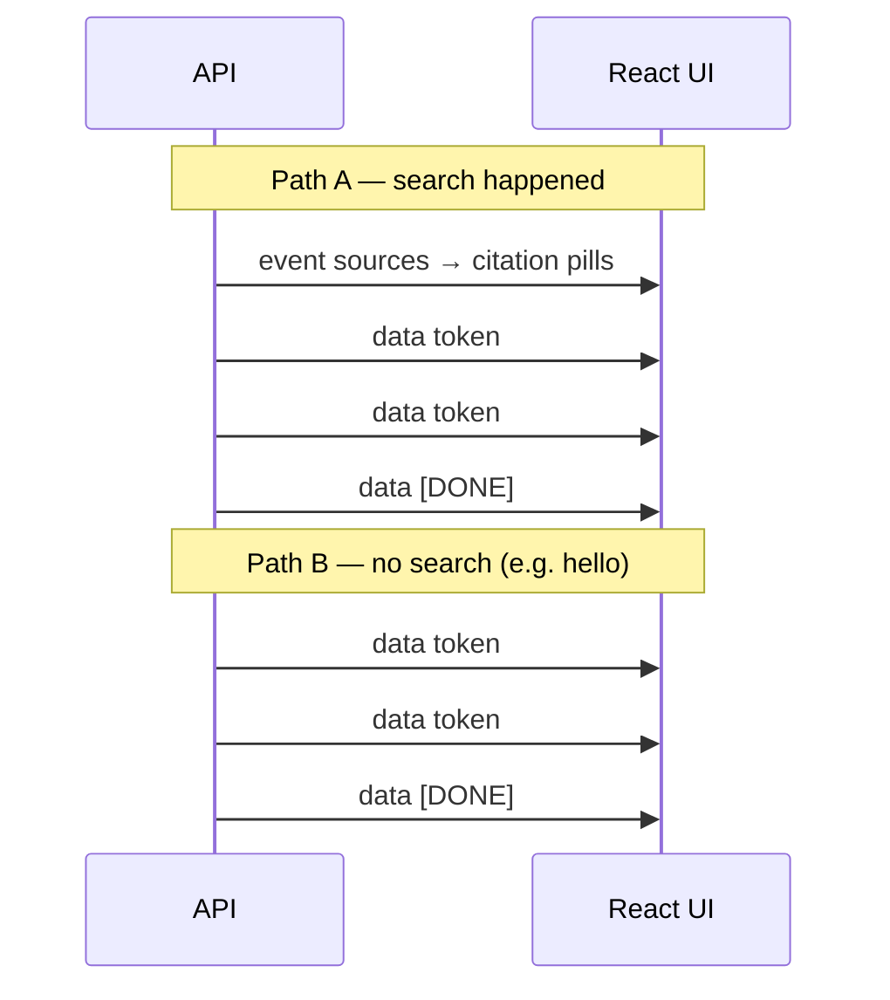

---

## Architecture

### System map

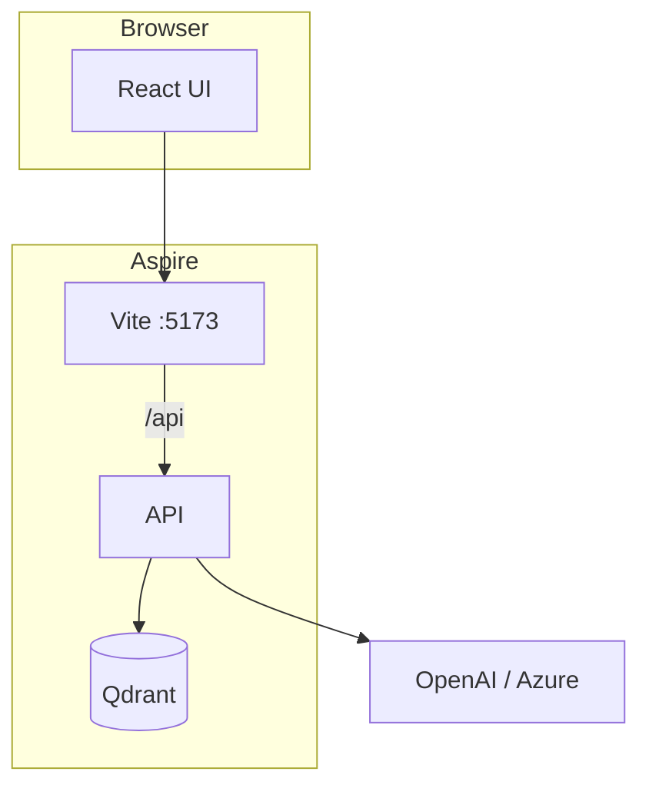

### Code layers

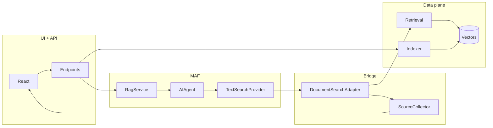

| Layer | MAF? |
|---|---|
| UI + Endpoints | No |
| Agent + TextSearchProvider | **Yes** |
| Adapter + SourceCollector | Bridge |
| Indexer + Retrieval + Vectors | No |

---

## Request flows

### Upload a document

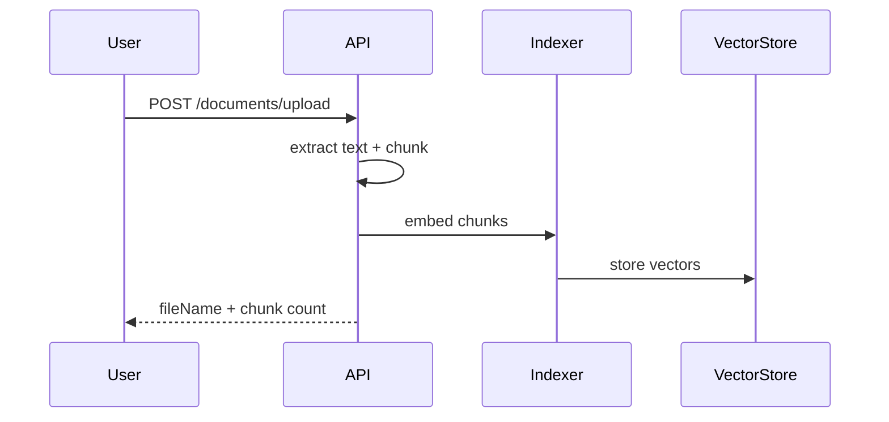

### Chat with search (full path)

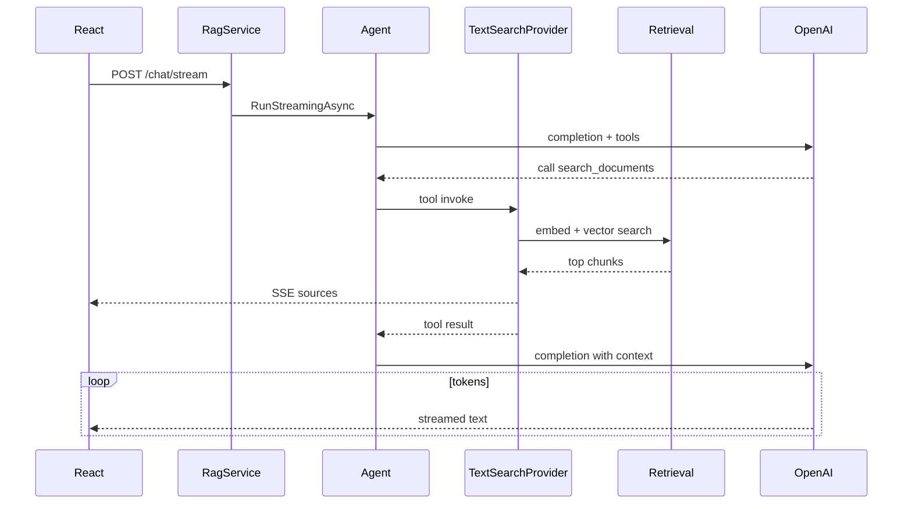

### Chat without search

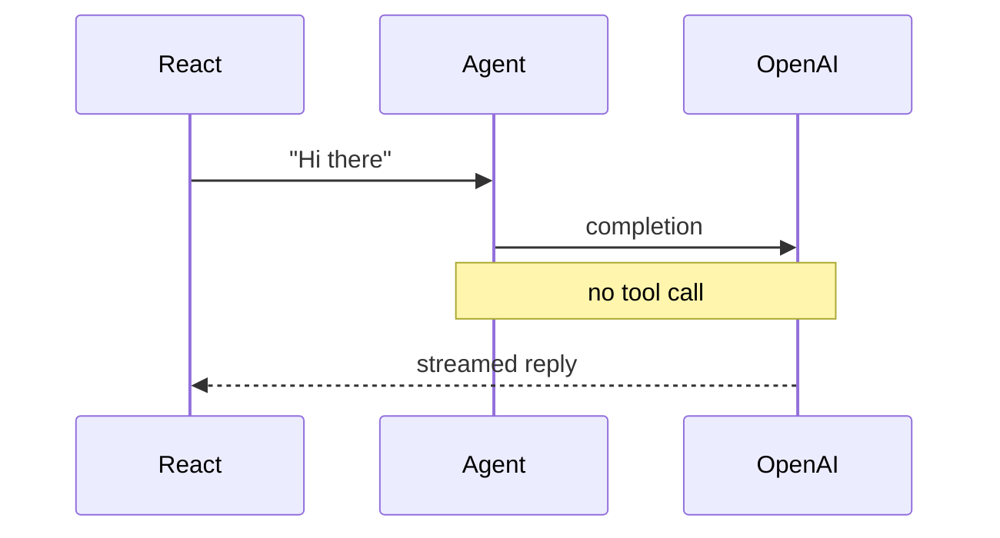

### No documents indexed

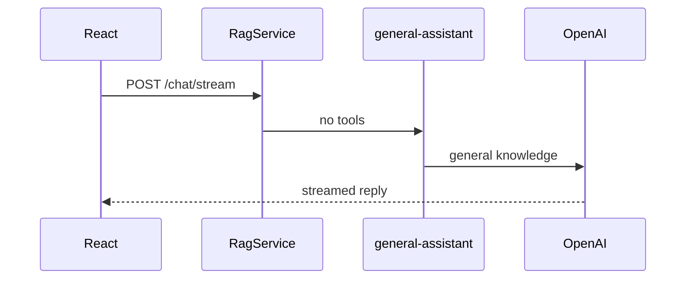

---

## Features

- **Agentic RAG** — model chooses when to call `search_documents`
- **Live citations** — source pills before answer text streams
- **Multi-turn** — last 10 messages sent with each request
- **Semantic chunking** — 800 chars, 150 overlap
- **Relevance filter** — cosine score ≥ 0.3
- **Token budget** — ~3,000 tokens of context
- **Bounded tools** — max 3 search roundtrips per request
- **Qdrant optional** — persistent vectors via Aspire

---

## Prerequisites

- [.NET 10 SDK](https://dotnet.microsoft.com/download)
- [Node.js 20+](https://nodejs.org/) with npm
- An **OpenAI API key** (or Azure OpenAI credentials)

---

## First-time setup

```bash
# 1. API key
cd AgentFrameworkRag.Api
dotnet user-secrets set "Ai:OpenAI:ApiKey" "sk-your-key-here"
cd ..

# 2. Frontend deps
cd react-frontend && npm install && cd ..

# 3. Restore
dotnet restore
```

---

## Running the application

```bash
cd AgentFrameworkRag
dotnet run
```

| Service | URL |
|---|---|
| Aspire dashboard | https://localhost:17181 |
| React frontend | http://localhost:5173 |
| API Reference (Scalar) | http://localhost:5123/scalar/v1 |
| Health check | http://localhost:5123/health |

```bash
cd AgentFrameworkRag.Api && dotnet run    # API only
cd react-frontend && npm run dev          # frontend only
dotnet test                                # unit tests
```

---

## Testing the API

```bash
# Health
curl http://localhost:5123/health

# Stream chat
curl -N -X POST http://localhost:5123/api/chat/stream \
  -H "Content-Type: application/json" \
  -d '{"message": "Summarise the uploaded document", "history": []}'

# Upload
curl -X POST http://localhost:5123/api/documents/upload -F "file=@/path/to/doc.pdf"

# List / delete
curl http://localhost:5123/api/documents
curl -X DELETE http://localhost:5123/api/documents/doc.pdf
```

---

## Using the React UI

1. Open `http://localhost:5173`
2. Upload documents in the sidebar
3. Ask a question — source pills appear, then the streamed answer
4. Try a follow-up or say "hello" (no search)
5. Use **Stop** to cancel streaming

---

## Configuration

### Azure OpenAI

```json
{ "Ai": { "Provider": "AzureOpenAI" } }
```

```bash
dotnet user-secrets set "Ai:AzureOpenAI:ApiKey" "your-key"
dotnet user-secrets set "Ai:AzureOpenAI:Endpoint" "https://your-resource.openai.azure.com/"
```

### Qdrant (persistent vectors)

```json
{ "Ai": { "VectorStore": { "Provider": "Qdrant" } } }
```

### RAG tuning (`Ai:Rag`)

| Setting | Default | Description |
|---|---|---|
| `TopK` | 6 | Chunks passed to the model |
| `CandidateK` | 20 | Vector search over-fetch |
| `MinRelevanceScore` | 0.3 | Min cosine similarity |
| `MaxContextTokens` | 3000 | Context token budget |
| `HistoryWindow` | 10 | Turns sent to agent |
| `MaxToolIterations` | 3 | Max tool roundtrips |

---

## Security note

Uploaded documents are injected into the LLM context — treat as untrusted input. No authentication; local dev and demos only.

---

## Project structure

```
AgentFrameworkRag/
├── AgentFrameworkRag/                 Aspire AppHost
├── AgentFrameworkRag.Api/             API + MAF agents + RAG
├── AgentFrameworkRag.Api.Tests/       xUnit tests
├── react-frontend/                    React UI
├── docs/FEATURES.md                   Component guide
└── README.md
```

---

## Further reading

- [docs/FEATURES.md](docs/FEATURES.md) — per-component what/why, MAF learning checklist
- [CLAUDE.md](CLAUDE.md) — developer commands
