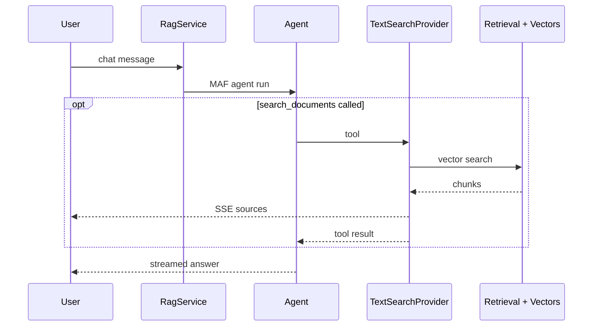
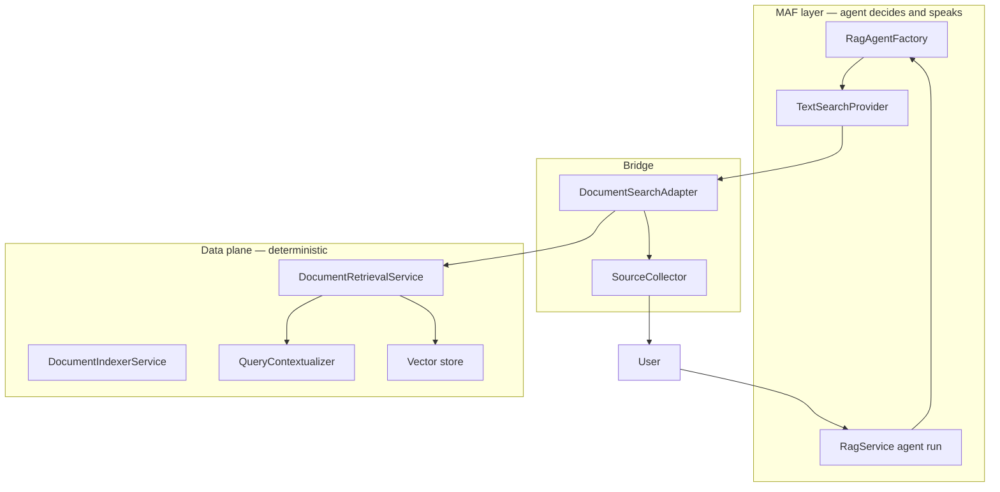

# Feature guide — what each piece does and why

This document explains every major component in AgentFrameworkRag: what it is, why it exists, and whether it uses **Microsoft Agent Framework (MAF)**.

For day-to-day commands, see [README.md](../README.md) — it leads with **visual sequence diagrams** for architecture and request flows. This file covers **what each component does and why** (MAF vs non-MAF). For agent/IDE hints, see [CLAUDE.md](../CLAUDE.md).

---

## At a glance

| Color in your head | Layer | Examples |
|---|---|---|
| **MAF** | Agent decides & speaks | `RagAgentFactory`, `TextSearchProvider`, `RunStreamingAsync` |
| **Bridge** | Connect MAF to app | `DocumentSearchAdapter`, `SourceCollector` |
| **Non-MAF** | Deterministic data work | `DocumentIndexerService`, `TextChunker`, vector store |

---

## Documentation approach: this file vs code comments

| Approach | Best for |
|---|---|
| **`docs/FEATURES.md` (this file)** | Learning, onboarding, demos, architecture reviews — the full “what and why” story |
| **Short code comments** | Non-obvious boundaries only (e.g. “why this bypasses MAF”) — see markers like `// MAF:` and `// Non-MAF:` in key files |
| **Per-feature `.md` files** | Not used here — one guide stays easier to maintain and search |

Rule of thumb: if someone asks *“why is this designed this way?”*, the answer lives here. If someone reads a class and wonders *“MAF or not?”*, a one-line comment points here.

---

## MAF vs non-MAF — the split

**Use MAF when** the model should decide (search or not, how to answer, tool calls).

**Keep non-MAF when** the work is deterministic (chunk, embed, filter scores, HTTP, UI).

---

## Quick reference table

| Component | Type | What it does | Why we use it |
|---|---|---|---|
| `RagAgentFactory` | **MAF** | Creates `general-assistant` and `document-assistant` agents | Central place for agent instructions, `TextSearchProvider`, tool limits |
| `TextSearchProvider` | **MAF** | MAF built-in RAG provider; exposes `search_documents` tool | Agentic retrieval — model chooses when to search (not always-on pre-fetch) |
| `DocumentSearchAdapter` | **Bridge** | Maps `DocumentRetrievalService` results → MAF `TextSearchResult` | Connects our vector search to MAF’s tool without putting search logic inside the agent |
| `SourceCollector` | **Bridge** | Per-request channel for source citations | Tool runs inside MAF; UI needs structured sources over SSE before answer text |
| `ChatRequestContext` | **Bridge** | Scoped message + history for the current HTTP request | Lets retrieval use conversation context when the tool runs |
| `RagService` | **MAF + app** | Picks agent, runs `RunStreamingAsync` / `RunAsync`, multiplexes SSE | Thin orchestration — does **not** pre-fetch documents anymore |
| `QueryContextualizer` | **Extensions.AI** | Rewrites follow-up questions via `IChatClient` | Better embedding search on “What about Q3?” — fixed retrieval step, not a user-facing agent |
| `DocumentRetrievalService` | **Non-MAF** | Embed query, vector search, filter, diversify, token budget | Core search engine; same logic whether called from a tool or a pipeline |
| `DocumentIndexerService` | **Non-MAF** | Chunk, embed, upsert to vector store | Ingestion is deterministic — no agent judgment needed |
| `TextChunker` | **Non-MAF** | Splits text at paragraph/sentence/word boundaries | Preserves meaning for retrieval quality |
| `TextExtractor` | **Non-MAF** | Reads `.txt`/`.md`/`.csv`/`.pdf` into text | File format handling, not AI orchestration |
| `DocumentRegistry` | **Non-MAF** | Tracks indexed doc names → chunk IDs | Fast list/delete; complements vector store |
| `DocumentRegistrySeeder` | **Non-MAF** | Rebuilds registry from Qdrant on startup | Qdrant persists vectors; registry is in-memory |
| `DocumentChunk` | **Non-MAF** | Vector store record (embedding + metadata) | `CommunityToolkit.VectorData` model |
| `TokenEstimator` | **Non-MAF** | Token count for context budget (SharpToken) | Keeps retrieved chunks within `MaxContextTokens` |
| `ChatEndpoints` | **Non-MAF** | REST + SSE API | Standard ASP.NET Core transport |
| `DocumentEndpoints` | **Non-MAF** | Upload / list / delete documents | File HTTP API |
| `Program.cs` | **Mixed** | DI, `IChatClient`, embeddings, vector store | Wires MAF’s underlying `IChatClient` — agents are built on top |
| `ServiceDefaults` | **Non-MAF** | Aspire OTel, health, service discovery | Platform plumbing; includes MAF trace/meter sources |
| React frontend | **Non-MAF** | Chat UI, upload, SSE client | User interface |

---

## MAF features (detailed)

### `RagAgentFactory`

**File:** `AgentFrameworkRag.Api/Agents/RagAgentFactory.cs`

**What:** Builds and caches two `AIAgent` instances:

- **`general-assistant`** — no tools; used when no documents are indexed.
- **`document-assistant`** — `TextSearchProvider` + function invocation middleware.

**Why MAF:** This is the main agent entry point. Instructions, context providers, and tool calling are MAF concepts.

**Notable settings:**

- `UseFunctionInvocation` + `MaxToolIterations` — caps multi-hop search cost per request.
- `UseOpenTelemetry` — traces agent and tool activity in Aspire.

---

### `TextSearchProvider` (`search_documents`)

**File:** configured in `RagAgentFactory.cs`

**What:** MAF’s built-in RAG context provider. In **on-demand** mode it registers a tool the model can call instead of auto-searching every turn.

**Why MAF:** This is the recommended MAF pattern for agentic RAG — avoids a custom `AIFunction` + `AIContextProvider` hand-roll.

**Behavior:**

- Model calls `search_documents` with a query it formulates.
- MAF invokes `DocumentSearchAdapter.SearchAsync`.
- Results are fed back into the agent loop for the final answer.

**Why not `BeforeAIInvoke` mode:** That would search on every message (classic RAG), including “hello” — wasteful and not agentic.

---

### `RagService` (agent execution)

**File:** `AgentFrameworkRag.Api/Services/RagService.cs`

**What:**

1. Sets `ChatRequestContext` for the request.
2. Chooses general vs document agent.
3. Creates `AgentSession`, builds message list from client history.
4. Runs `RunStreamingAsync` or `RunAsync`.
5. Multiplexes `SourceCollector` events with agent text for SSE.

**Why MAF:** User-facing chat goes through `AIAgent` — streaming, sessions, tool loop.

**Why not more MAF:** Indexing and document CRUD stay as plain service calls — no agent needed.

---

### `AgentSession`

**What:** MAF per-invocation session object (`CreateSessionAsync` per request).

**Why:** Required by `RunAsync` / `RunStreamingAsync`. We do **not** persist sessions server-side (client still sends history). That’s intentional for this app’s scope.

---

### OpenTelemetry + MAF meters

**File:** `AgentFrameworkRag.ServiceDefaults/Extensions.cs`

**What:** Registers `*Microsoft.Agents.AI` and `AgentFrameworkRag` trace sources and meters.

**Why:** See tool calls and agent spans in the Aspire dashboard during demos and debugging.

---

## Bridge layer (MAF ↔ app)

### `DocumentSearchAdapter`

**File:** `AgentFrameworkRag.Api/Agents/DocumentSearchAdapter.cs`

**What:** Implements the delegate passed to `TextSearchProvider` — calls `DocumentRetrievalService`, publishes sources, returns `TextSearchResult` chunks.

**Why not inside MAF:** Vector search, scoring, and chunk selection are app/domain logic. MAF only needs a search function signature.

---

### `SourceCollector`

**File:** `AgentFrameworkRag.Api/Agents/SourceCollector.cs`

**What:** Scoped per HTTP request. Deduplicates sources and pushes them on a `Channel` for SSE.

**Why:** MAF tool results go to the model as text. The React UI needs structured `{ documentName, page, score, excerpt }` **before** answer tokens stream. This is app-specific plumbing, not an MAF feature.

---

### `ChatRequestContext`

**File:** `AgentFrameworkRag.Api/Agents/ChatRequestContext.cs`

**What:** Holds current user message and history for the active request.

**Why:** When the tool runs, `DocumentSearchAdapter` passes history into retrieval so follow-up searches stay accurate — without storing state on the agent singleton.

---

## Extensions.AI (not MAF, but AI-related)

### `IChatClient` + `IEmbeddingGenerator`

**File:** `AgentFrameworkRag.Api/Program.cs`

**What:** `Microsoft.Extensions.AI` abstractions over OpenAI / Azure OpenAI.

**Why:** MAF agents are built **on top of** `IChatClient`. Embeddings are a separate concern (indexing + search), not part of the agent loop.

---

### `QueryContextualizer`

**File:** `AgentFrameworkRag.Api/Services/QueryContextualizer.cs`

**What:** One-shot LLM call to rewrite “What about revenue?” → “What was Q3 revenue in the report?” using recent history.

**Why `IChatClient` directly, not an `AIAgent`:**

- Fixed retrieval preprocessing — always runs inside search, not a user-visible decision.
- Avoids an extra agent wrapper, session, and tool surface for a single internal rewrite.
- Failures fall back to the original query (safe default).

**Could move to MAF later?** Only if you want a visible “query rewriter agent” for learning — not required for this product.

---

## Data plane (non-MAF)

### `DocumentIndexerService`

**What:** Chunk → embed → upsert to vector collection → register chunk IDs.

**Why non-MAF:** Upload indexing is a batch pipeline with predictable steps. No model judgment required.

---

### `DocumentRetrievalService`

**What:**

1. Optional query contextualization.
2. Embed query.
3. Vector search (`CandidateK` over-fetch).
4. Filter by `MinRelevanceScore`.
5. Diversify across documents (`MaxChunksPerDocument`).
6. Trim to `MaxContextTokens`.

**Why non-MAF:** This is the search engine. The **agent** decides *when* to call it; this service decides *how* to search well.

---

### `TextChunker` / `TextExtractor`

**What:** Semantic chunking (800 chars, 150 overlap) and file parsing (including PDF via PdfPig).

**Why non-MAF:** Deterministic text processing.

---

### `DocumentRegistry` / `DocumentRegistrySeeder`

**What:** In-memory map of document names to chunk GUIDs; seeder rebuilds from Qdrant after restart.

**Why non-MAF:** Operational metadata for list/delete and duplicate detection. Vector store holds embeddings; registry holds app-level bookkeeping.

---

### `DocumentChunk` + vector store

**What:** `CommunityToolkit.VectorData` with `InMemoryVectorStore` (dev) or `QdrantVectorStore` (persistent).

**Why non-MAF:** Standard vector DB pattern — not an MAF concern.

---

## API & frontend (non-MAF)

### `ChatEndpoints`

**What:** `POST /api/chat`, `POST /api/chat/stream` (SSE: `sources`, text deltas, `[DONE]`).

**Why:** Thin HTTP layer over `IRagService`. Contract unchanged after agentic RAG refactor.

---

### React (`useChat`, `MessageBubble`, `DocumentUpload`)

**What:** Streaming chat, source pills, document upload via React Query.

**Why non-MAF:** UI and client-side history (last 10 messages in `localStorage`). Server does not persist conversations.

---

## Configuration

| Setting | Purpose |
|---|---|
| `Ai:Provider` | OpenAI vs Azure OpenAI |
| `Ai:Rag:TopK`, `CandidateK`, `MinRelevanceScore` | Retrieval quality |
| `Ai:Rag:MaxContextTokens` | Context size cap |
| `Ai:Rag:MaxToolIterations` | MAF tool loop cap (default 3) |
| `Ai:VectorStore:Provider` | `InMemory` vs `Qdrant` |

---

## What we deliberately did **not** add (and why)

| MAF feature | Why skipped for this app |
|---|---|
| Workflows | Single agent + tool is enough for doc Q&A |
| Multi-agent / handoff | No specialist domains (legal vs finance, etc.) |
| Server-side session memory | Client history works; adds complexity |
| MCP / A2A | No external tool ecosystem in scope |
| Agent Harness (shell, files, todos) | Not a coding/automation agent |

See [README.md — Agentic RAG flow](../README.md) for the end-user flow.

---

## Learning checklist — MAF concepts this repo covers

- [x] `AIAgent` + `AsAIAgent()`
- [x] `ChatClientAgentOptions` (name, instructions, context providers)
- [x] `TextSearchProvider` with on-demand tool calling
- [x] Function invocation middleware + iteration limits
- [x] `AgentSession`, `RunAsync`, `RunStreamingAsync`
- [x] Agent builder + OpenTelemetry
- [x] Clear separation: MAF for decisions, services for data

**Learn elsewhere:** workflows, multi-agent, durable execution, MCP, server session persistence.
